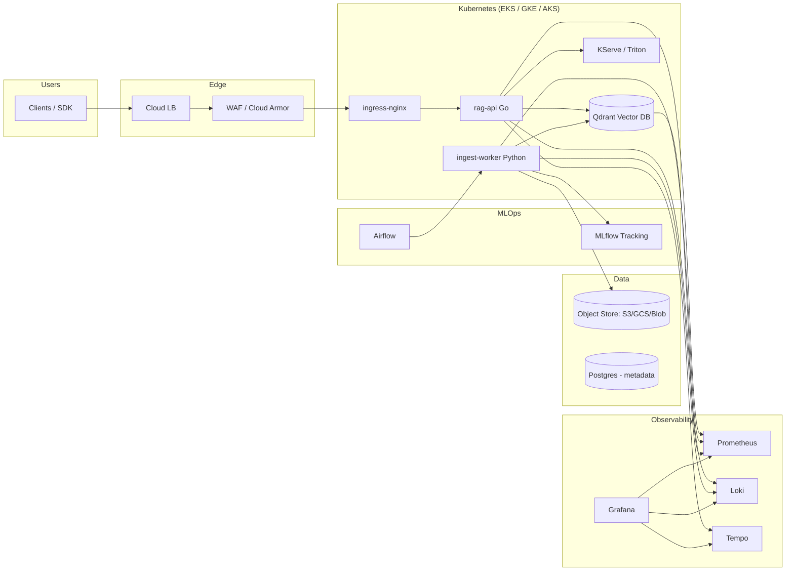
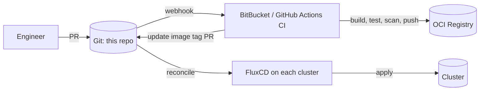

# Architecture

This document describes the system architecture of the RAG platform infrastructure.

## High-level diagram

## Cluster topology

Each environment (`dev`, `staging`, `prod`) maps to one Kubernetes cluster on one cloud:

| Environment | Cloud | Region | Purpose |
| --- | --- | --- | --- |
| `dev-eks` | AWS | `us-east-1` | Engineering iteration |
| `staging-gke` | GCP | `us-central1` | Pre-prod soak, customer demos |
| `prod-aks` | Azure | `eastus2` | Production workloads |

Multi-cloud is **not** active/active for the application data plane — it is **portability insurance** plus a way to honor enterprise customer cloud preferences. Each cluster is independently reconcilable from this repo, and the Helm charts and Flux config are cloud-neutral.

## Networking

- Private control planes everywhere; admin access via SSO + jump host or cloud-native bastion (AWS SSM, GCP IAP, Azure Bastion).
- Worker subnets are private. Egress through a NAT gateway (AWS), Cloud NAT (GCP), or NAT Gateway (Azure).
- East-west traffic restricted by `NetworkPolicy` (default-deny per namespace).
- Mesh: optional sidecar mesh (Linkerd) is opt-in via Helm values; the platform does not require a mesh to operate.

## Identity & secrets

| Cloud | Pod identity | Secret store |
| --- | --- | --- |
| AWS | IRSA (IAM Roles for Service Accounts) | AWS Secrets Manager via External Secrets Operator |
| GCP | Workload Identity | Secret Manager via External Secrets Operator |
| Azure | Workload Identity | Azure Key Vault via External Secrets Operator |

No long-lived cloud credentials live in Kubernetes secrets or environment variables.

## CD: GitOps with FluxCD

- One source of truth: this repo.
- Image promotion: image automation controllers update `flux/clusters/<name>/` on new tags matching the env's policy (e.g. `prod` only takes `v*.*.*` semver tags).
- Rollback: `git revert` of the promotion commit.

## Observability

Golden signals (latency, traffic, errors, saturation) are exposed by every service:

- **Metrics:** Prometheus scrapes via `ServiceMonitor`. Long-term storage via remote-write to Mimir / Cortex (configurable).
- **Logs:** apps log JSON to stdout; Promtail ships to Loki.
- **Traces:** OpenTelemetry SDK → OTel Collector → Tempo. The Go API propagates W3C trace context to downstream services and the vector DB client.

SLOs are defined as code (Sloth format) under [observability/slo/](observability/slo/) and compiled into multi-window burn-rate alerts.

## SRE practices

- Every alert links to a runbook in [docs/runbooks/](docs/runbooks/).
- Alerts use the multi-window, multi-burn-rate pattern (Google SRE workbook).
- Self-healing automation lives in [scripts/self-healing/](scripts/self-healing/) — small, single-purpose controllers that handle the top three recurring incidents (PVC fill, leader-election deadlocks, vector-DB compaction stalls).
- A monthly chaos exercise (`scripts/chaos/`) validates that the SLOs hold under failure injection.

## Application architecture

### `rag-api` (Go)

- HTTP API: `/v1/query`, `/v1/documents`, `/healthz`, `/readyz`, `/metrics`.
- Embedding via remote model server (KServe/Triton) — no local CUDA.
- Vector retrieval against Qdrant (HNSW).
- Re-ranking optional, gated by a feature flag.
- Strict context budget enforcement and cancellation propagation.

### `ingest-worker` (Python)

- Consumes ingest jobs from a queue (Airflow trigger or a Pub/Sub-style topic).
- Chunks documents, calls the embedder, writes to Qdrant.
- Records ingest runs (model version, doc counts, latencies) to MLflow.
- Idempotent: chunk IDs derived from a content hash so re-runs converge.

### Vector DB

Qdrant deployed as a StatefulSet with persistent volumes, a PDB, and a per-shard `ServiceMonitor`. Backups are taken via a CronJob to object storage (S3/GCS/Blob). See [helm/charts/vector-db/](helm/charts/vector-db/).

## Security posture

- Pod Security Admission `restricted` enforced on all app namespaces.
- All container images run as non-root, read-only root filesystem.
- Image scanning (Trivy) and SBOM generation in CI; images are signed with cosign.
- Admission control: Kyverno policies enforce signed images, required labels, resource limits.
- NetworkPolicies default-deny; explicit allow-list per service.
- Audit logs shipped from the cluster API server to Loki and an append-only object store for long-term retention.

## Capacity & cost

- Cluster autoscaler + Karpenter (EKS) / Cluster Autoscaler (GKE/AKS).
- HPA on all stateless services; KEDA for queue-driven scaling of the ingest worker.
- Right-sizing: `goldilocks` recommendations reviewed monthly and folded back into Helm values.
- Cost dashboards in Grafana sourced from cloud billing exports + OpenCost.
